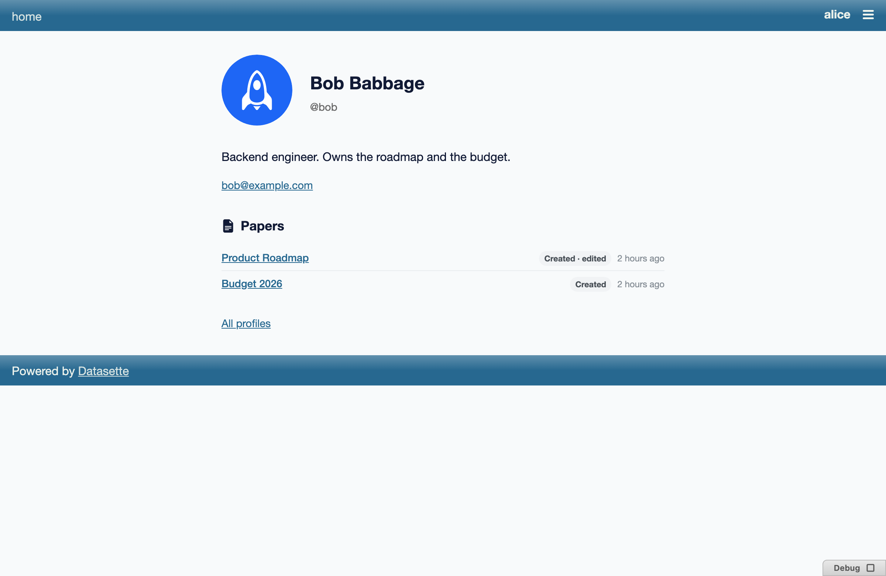
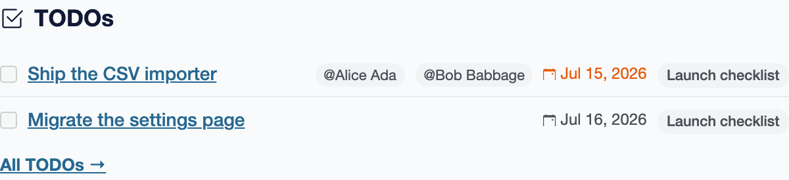

# Configuration

## Permissions

datasette-paper has one global, config-driven permission and three per-paper
actions resolved by [datasette-acl](https://github.com/datasette/datasette-acl)
grants rather than static config. See [Permissions](permissions/index.md) for
the full model; this page covers the config surface.

| Action | Scope | Resolved by |
|---|---|---|
| `datasette-paper-create` | global | standard Datasette config permissions (`-s permissions.*` / `permissions:` block) |
| `paper-view` | per-paper (`PaperDocResource`) | datasette-acl grants |
| `paper-edit` | per-paper (`PaperDocResource`, also-requires `paper-view`) | datasette-acl grants, plus the read-only `locked` deny |
| `paper-manage` | per-paper (`PaperDocResource`, also-requires `paper-view`) | datasette-acl grants (the Manager role) |

Listing is ungated — the index and list endpoints return only the papers acl
says the actor can view, so there's no separate list permission.

Grant the one global action from the command line:

```bash
datasette --internal papers.db \
  -s permissions.datasette-paper-create true
```

or in `datasette.yaml`:

```yaml
permissions:
  datasette-paper-create: true
```

The value can be `true` (everyone), an actor-id object (`{"id": "alice"}`), or
any standard Datasette permission expression.

:::{note}
Do **not** statically grant `paper-view` / `paper-edit` / `paper-manage` in
production config — those are meant to be resolved per-paper through acl
grants (seeded automatically for the paper's owner, and extended via the
share dialog). Granting them globally bypasses the share model and lets
every actor read/write/manage every paper. See
[Permissions § Configuration](permissions/index.md) for the deliberate
exception the e2e test suite makes.
:::

## Persisting papers

Pass `--internal <path>` so papers survive a restart — see
[Installation § Persisting papers](installation.md#persisting-papers).

## Profile integration

When [datasette-user-profiles](https://github.com/datasette/datasette-user-profiles)
is installed, each person's profile page grows a **Papers** section listing
the papers that actor created plus the ones they've recently edited, newest
activity first, each badged Created / Edited. The list is filtered to the
papers the *viewer* is allowed to see. The section is populated from
`GET /-/paper/api/profile/<actor>/docs`.



The same integration adds a **TODOs** section listing that person's open
assigned tasks (see [Editor § Task lists](editor.md#task-lists)), viewer-filtered
the same way, fed by `GET /-/paper/api/profile/<actor>/todos`.



Display-name / avatar resolution for both sections is gated on
datasette-user-profiles' own `profile_access` action, and degrades to the
raw actor id (never a 403) when that's denied.
