# The editor

A rich-text document editor (ProseMirror-based) with tables, task lists,
callouts, code blocks, inline formatting, and a few block types built for
data — see [Sources and values](sources-and-values.md) and
[Embeds](embeds.md) for those. This page covers general-purpose formatting.

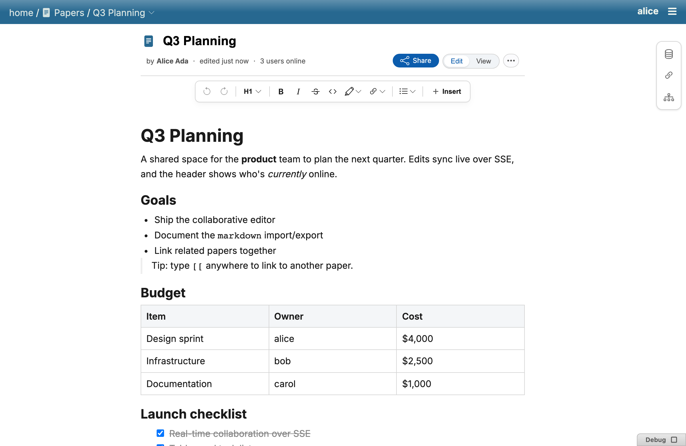

## Tables

A table family (rows, cells, header cells) with a floating action bar for
adding/removing rows and columns, plus an optional `name` so the table is
addressable via the [API](api.md#reading-structured-content) and the
[CLI](cli.md#tables) (`/tables/{name}`).

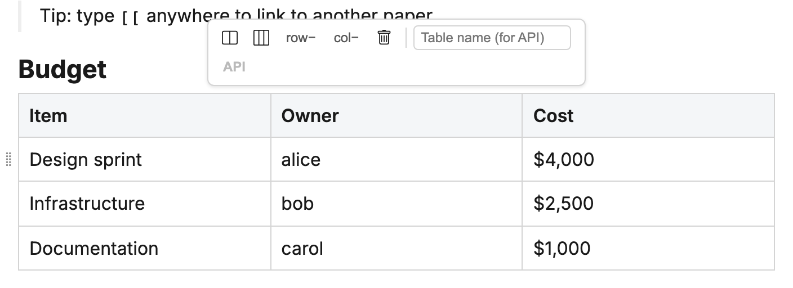

## Task lists

Checkbox lists (`- [ ]` / `- [x]`) with a live checkbox NodeView. A
`@mention` inside a task item assigns it to that person; a `date` atom
inside the item is its due date — pure interpretation of the document, no
separate assignment records. Assignment inherits down a task's subtree
(a sub-task with no mention of its own takes the parent's assignee).

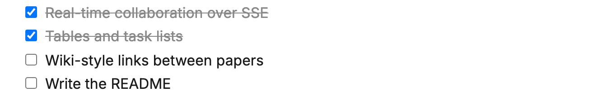

The dedicated `/-/paper/todos` page collects a person's assigned tasks
across every paper they can see, bucketed by due date — see
[Sharing](sharing.md) for the viewer-filtering rule that applies here too.

## Callouts

GitHub-style admonition blocks (`> [!NOTE]` and four sibling kinds) with a
title and body, foldable via a chevron that hides the body down to the
title (readers fold locally with no edit recorded).

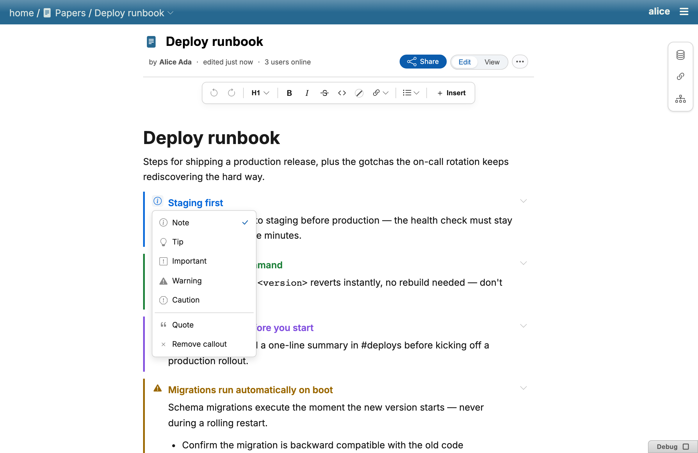

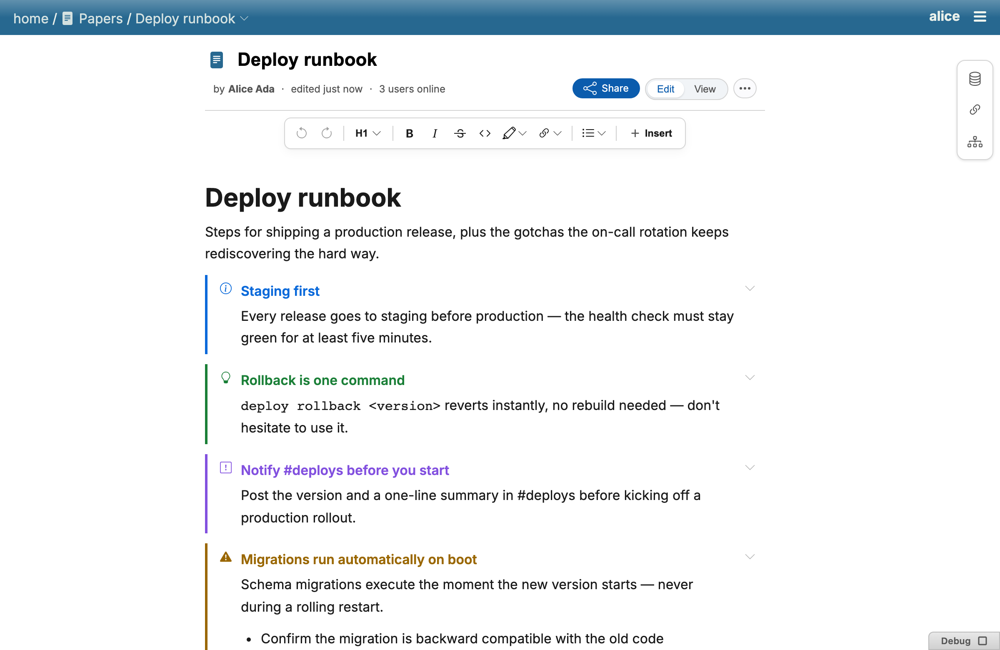

## Text marks: strikethrough & highlight

- **Strikethrough** — toolbar button, `Mod-Shift-x`, or a `~~text~~` input
  rule; round-trips as GFM `~~text~~`.
- **Highlight** — a four-color highlight mark from the toolbar swatch
  popover, `Mod-Shift-h` (repeats the last-used color), or an `==text==`
  input rule; round-trips as `<mark data-color="hlN">text</mark>`.

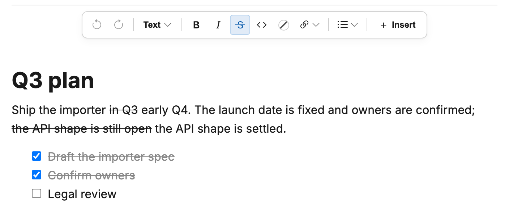

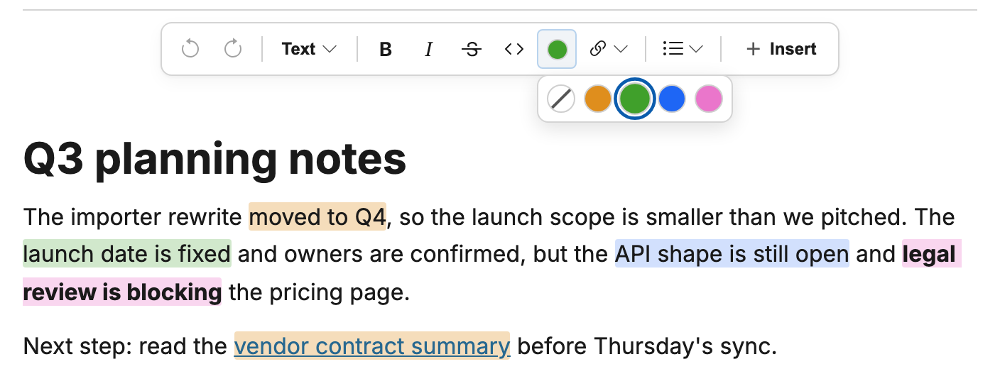

## Code blocks

Fenced code blocks carry a language (typed via ` ```lang ` + space/Enter, or
picked from a language popup) and get static syntax highlighting always; a
block gains a full CodeMirror editor (real indent, bracket matching,
completion) only while the selection is inside it, to keep the read path
free of CodeMirror's runtime cost.

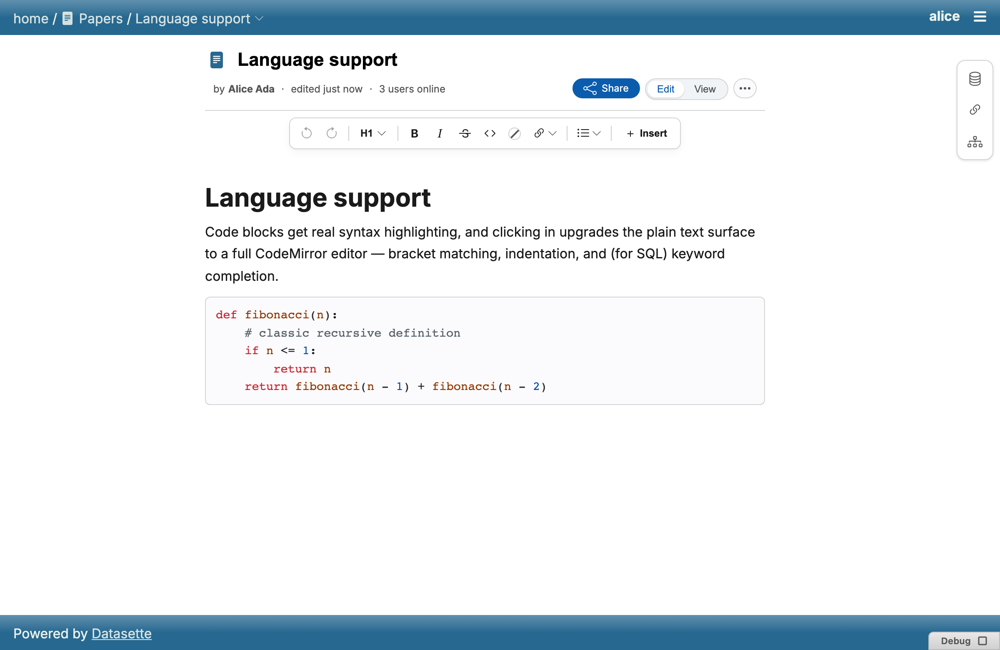

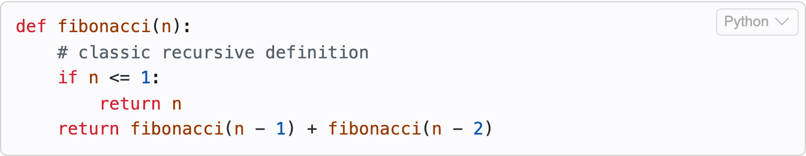

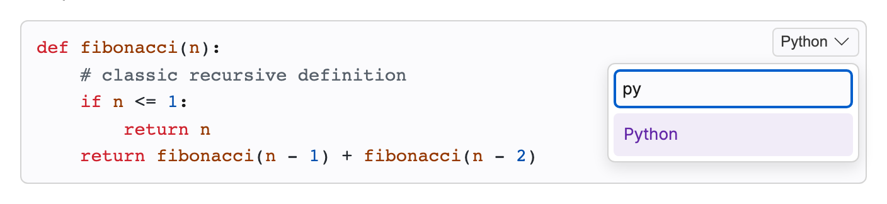

## Dates

An inline date atom — `/date` (or `/today`, `/tomorrow`, `/yesterday`) from
the slash menu, or `Mod-;` / `Mod-Shift-;` for today/tomorrow. A date inside
an unchecked task tints overdue (red) or due-today (amber); checking the box
clears the tint. Click a chip to edit it via natural language (`next fri
3pm`, `7/20`) with a live preview and a display-format picker.

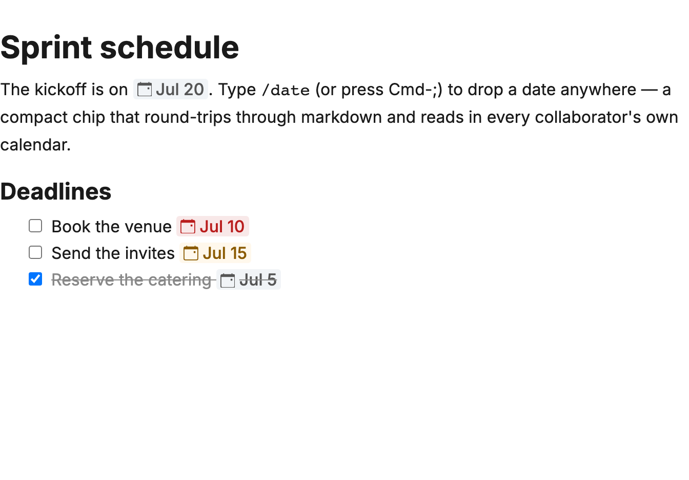

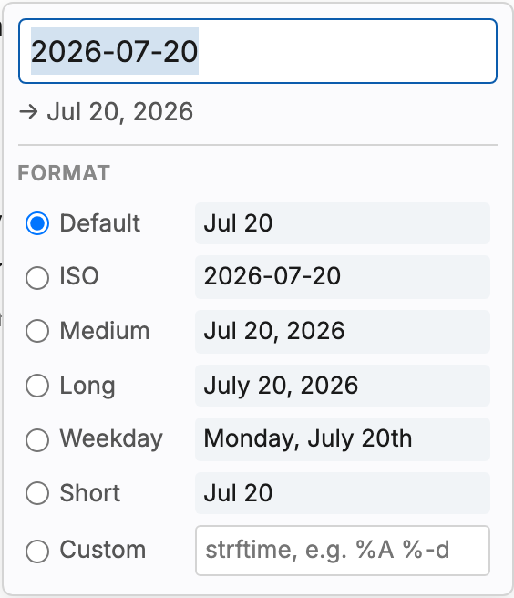

## Images

Insert by pasting, dropping a file, or the toolbar's image button, which
offers a paste area or a file upload with a live preview.

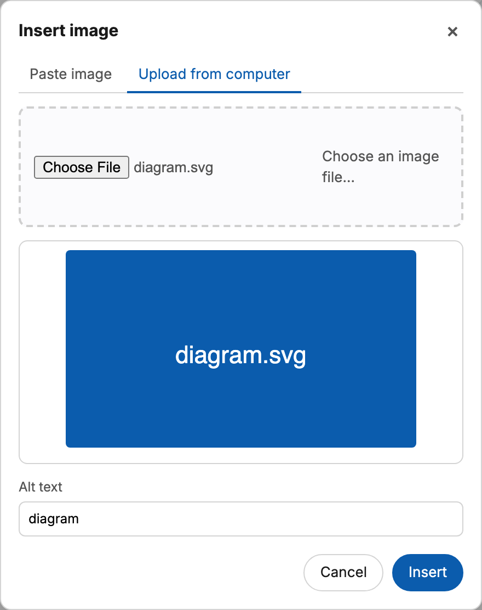

## Table of contents

A `toc` block renders a card listing the document's headings, each
clickable to scroll to that heading's current position (no persisted anchor
IDs — it tracks live document structure).

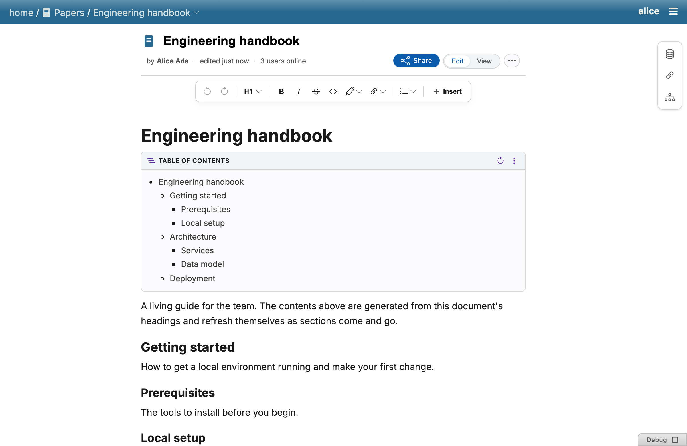

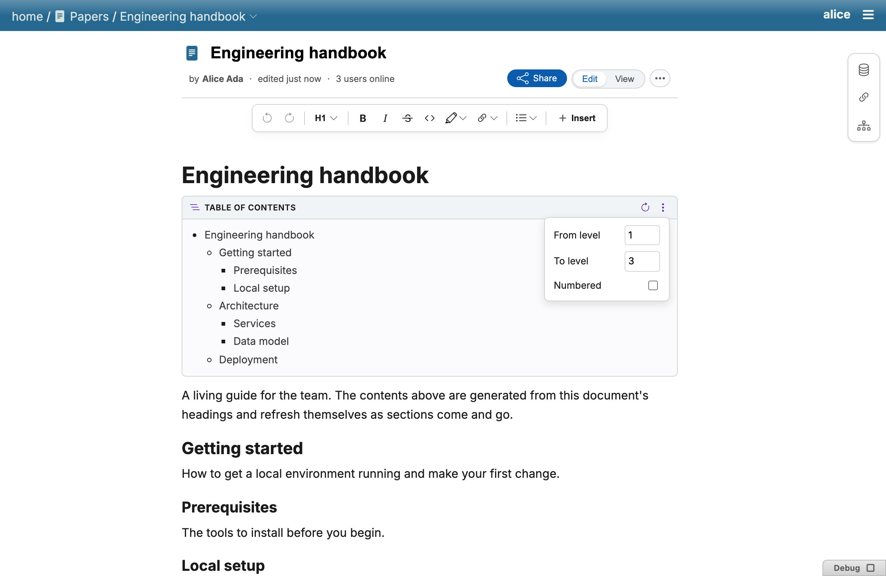

## Toolbar & keyboard

:::{note}
TODO: a walkthrough of the formatting toolbar's layout (marks, block-type
menu, insert menu) — see [Keyboard shortcuts](keyboard-shortcuts.md) for the
full key-binding reference in the meantime.
:::
