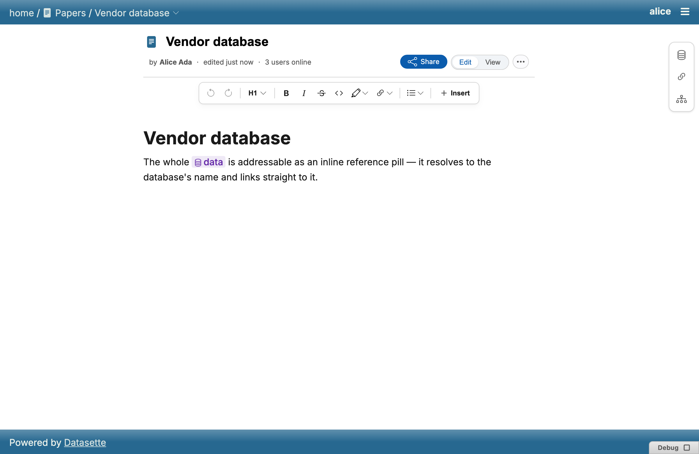
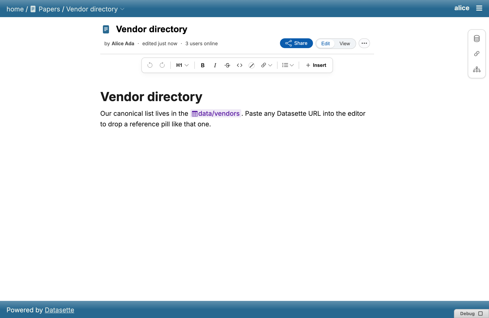
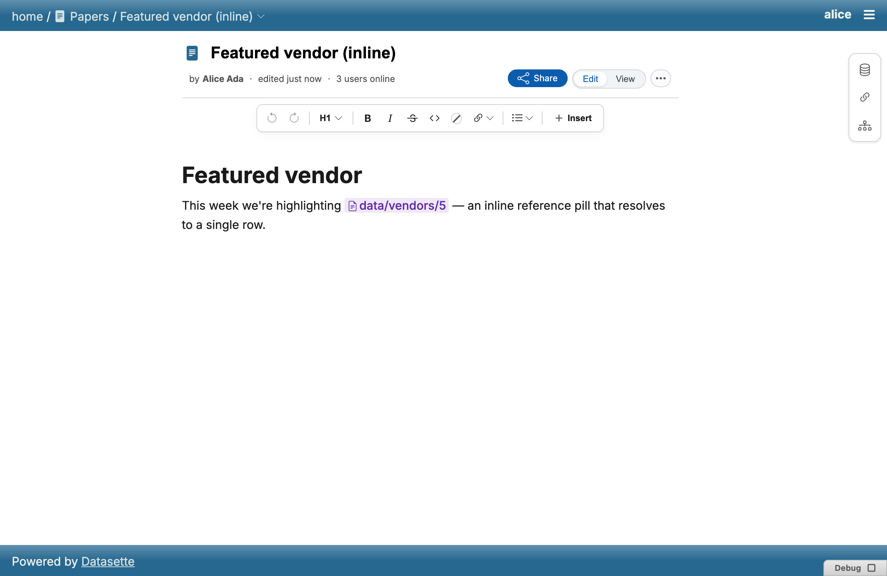
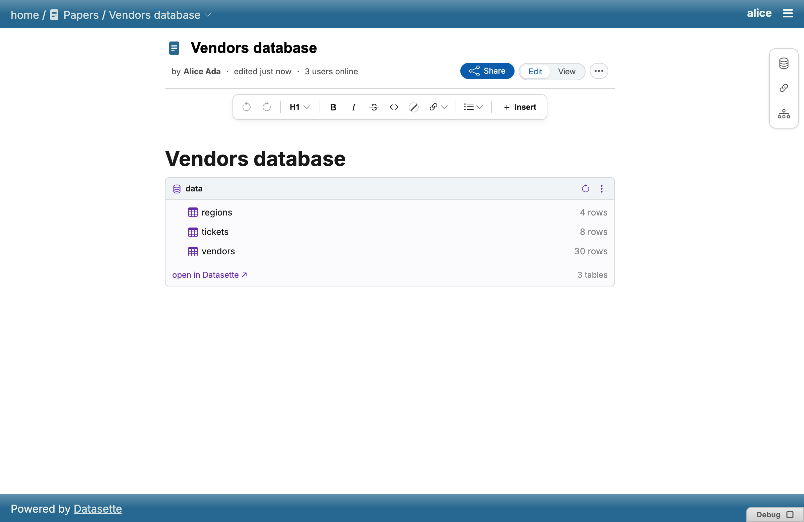
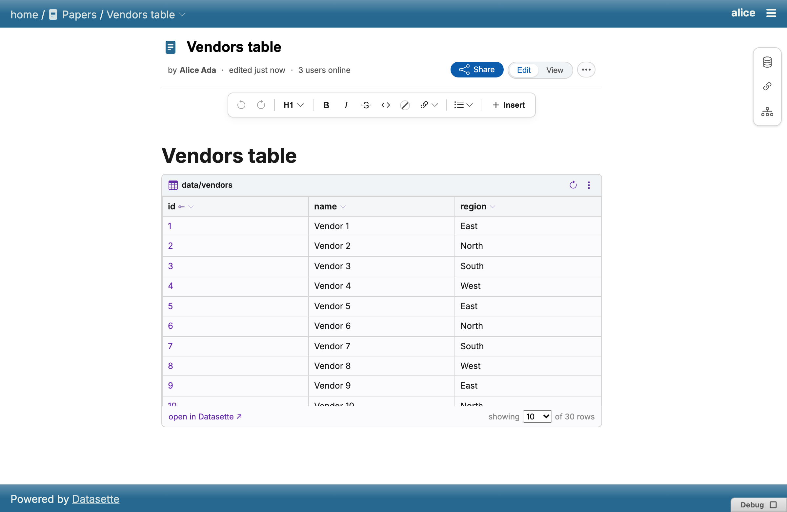
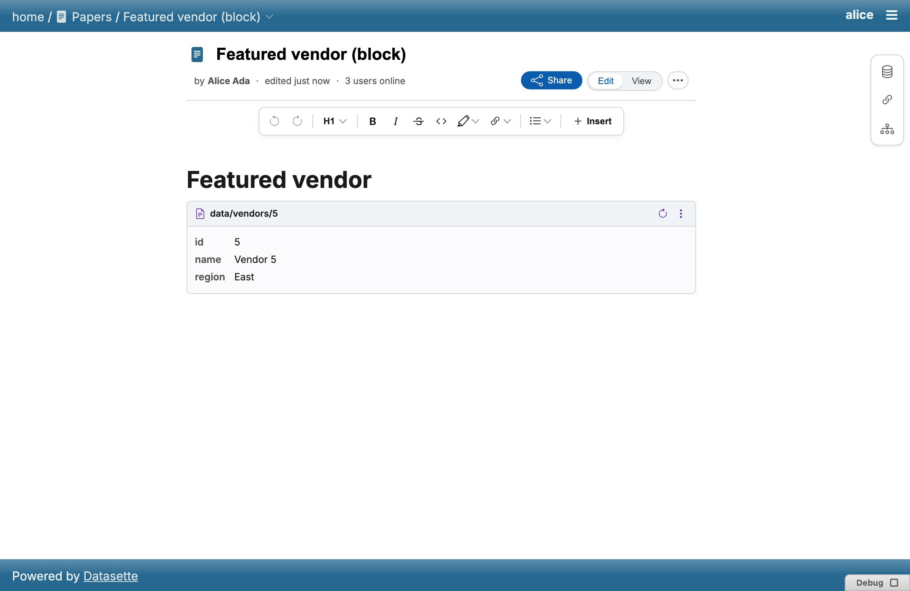
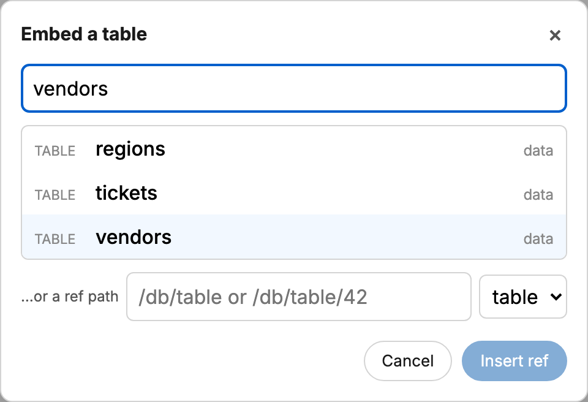
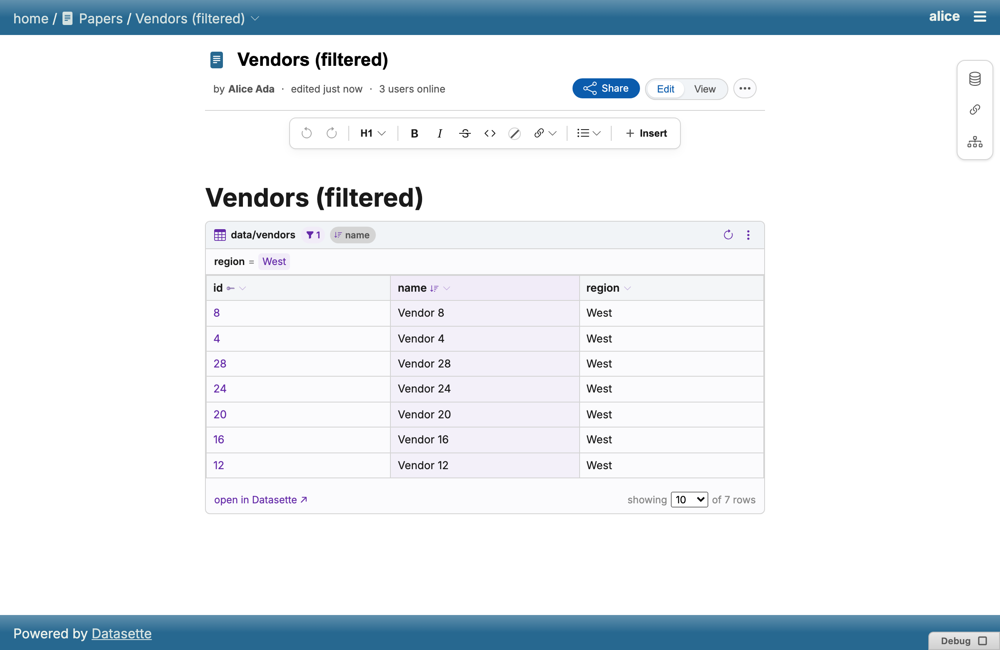
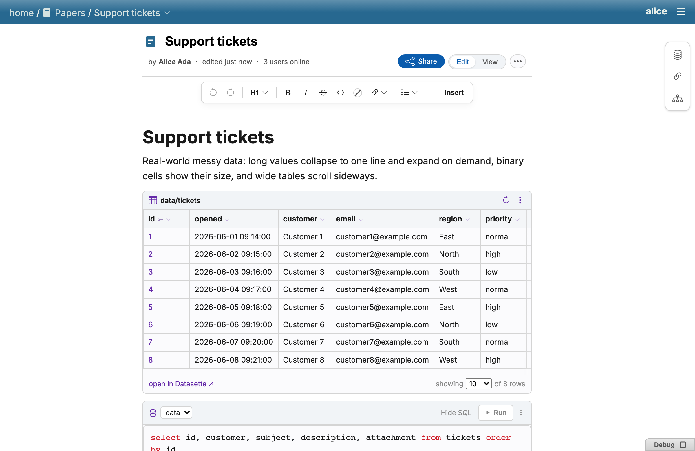
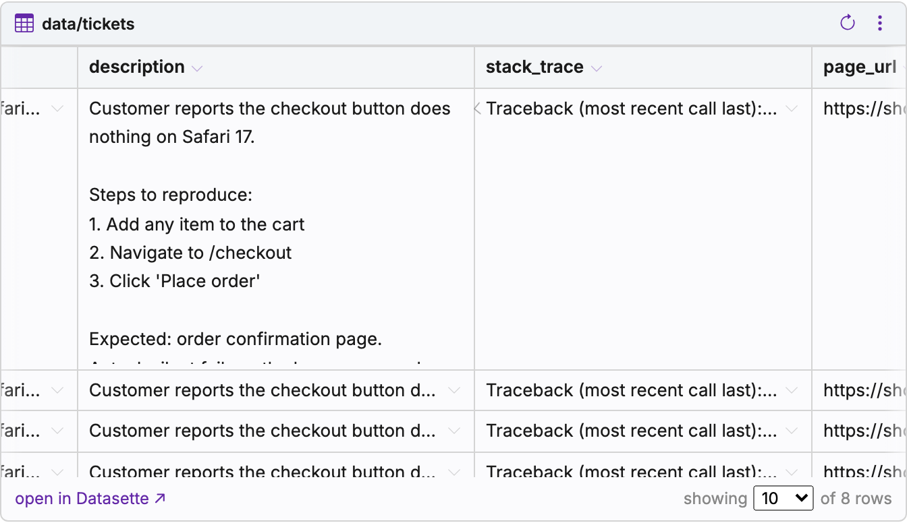

# Embeds

Paste or insert a live reference to a Datasette table, row or database, or a
YouTube link, directly into a paper. Embeds resolve and render **entirely in
the browser** against Datasette's native JSON API, using the viewer's own
`ds_actor` cookie — so a reader only ever sees what they're allowed to see.
Third-party plugins can add their own embed kinds; see
[Custom embeds](custom-embeds.md).

## Inline embeds

A small inline pill referencing a Datasette resource by its ref path,
resolved to a live label per viewer.

## Block embeds

A block-level card embedding a read-only, live render of a Datasette table,
row, or database — round-trips through markdown as a `paper-embed` JSON
fence.

Insert one from the [slash menu](slash-menu.md)'s Datasette section, which
opens a picker:

Table-embed rows link to their Datasette row page (a single primary key
links the pk cell itself; a compound key gets a leading `#` column), and pk
headers carry a key glyph and can't be hidden.

### Filtering & sorting

Table embeds carry Datasette-style filter/sort configuration, stored in the
embed's fence.

### Copying an embed's URL

Copying a block embed puts its full Datasette URL (with any filters, sort
and hidden columns in the query string) on the clipboard as plain text.

## Video embeds

A lone YouTube URL pasted in its own paragraph becomes a "lite" facade
block — a thumbnail that mounts the real iframe only on click — and
round-trips as a bare canonical watch URL on its own line.

:::{note}
TODO: screenshot of a video embed once one is captured
(`frontend/scripts/screenshots.mjs` has no `video-embed` case yet).
:::

## Result rendering

Embed and SQL result tables (and the single-row card) share clamped,
expandable cell rendering with h-scroll edge fades; blob values render as
their byte size rather than raw bytes.

