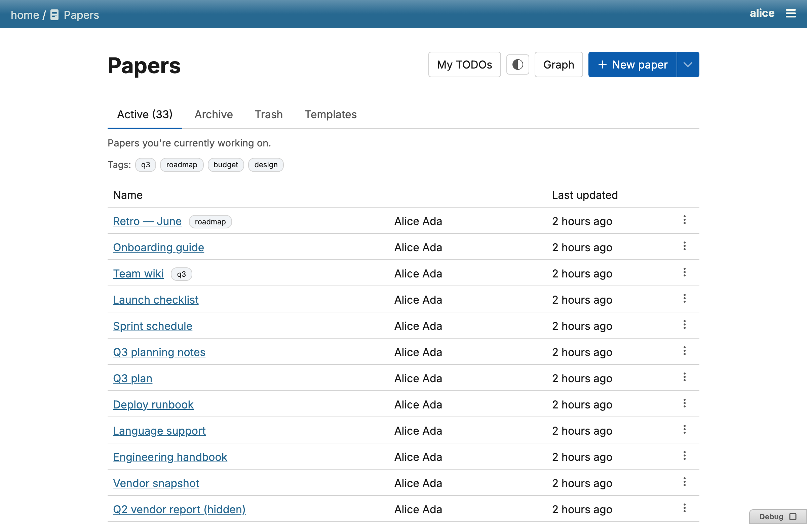
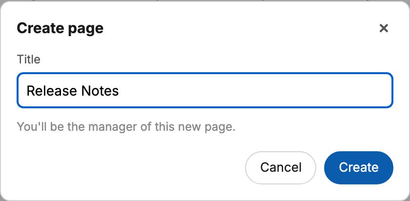

# Getting started

Once the plugin is [installed](installation.md) and running, the paper index
at `/-/paper` lists everyone's papers with author and last-edited time, plus
tabs for Active / Archive / Trash / Templates.

## Creating a paper

The index page's **New paper** split button creates a blank paper
(server-default name `Untitled`) in one click. Its caret menu opens a
template picker instead, so you can start from an existing template — or
create a new template — with a filterable list once you have more than a
handful.

A freshly created paper lands with the title focused and selected, so you
can rename it immediately; pressing Enter hands focus to the document body.

## Editing

Opening a paper drops you into the live [editor](editor.md) — a header
shows the author, last-edited time, and how many people are currently
online, all synced in real time over Server-Sent Events. See
[Editor](editor.md), [Slash menu](slash-menu.md) and
[Links, mentions & tags](links-mentions-tags.md) for what you can put in a
document.

(templates)=
## Templates

A template is a paper with `kind="template"` rather than `kind="doc"`.
Creating a paper *from* a template always produces a new `kind="doc"` paper
— using a template never turns you into one. A template's body can contain
`{{key}}` **placeholder** atoms, written only in templates, which are
substituted with real text server-side at the moment a new paper is created
from it (built-ins like `{today}` / `{actor}` resolve from the creating
actor's context). Placeholders are write-only — they're never parsed back
out of a finished paper.

## Sharing what you make

See [Sharing](sharing.md) for making a paper visible to other people, and
[Permissions](permissions/index.md) for the full access model.
