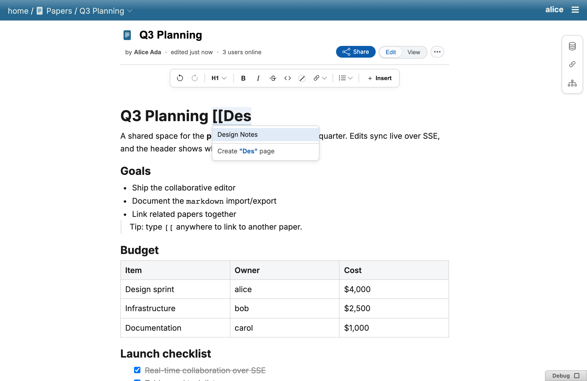
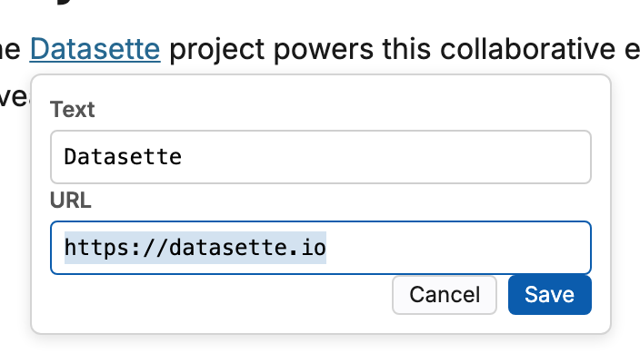
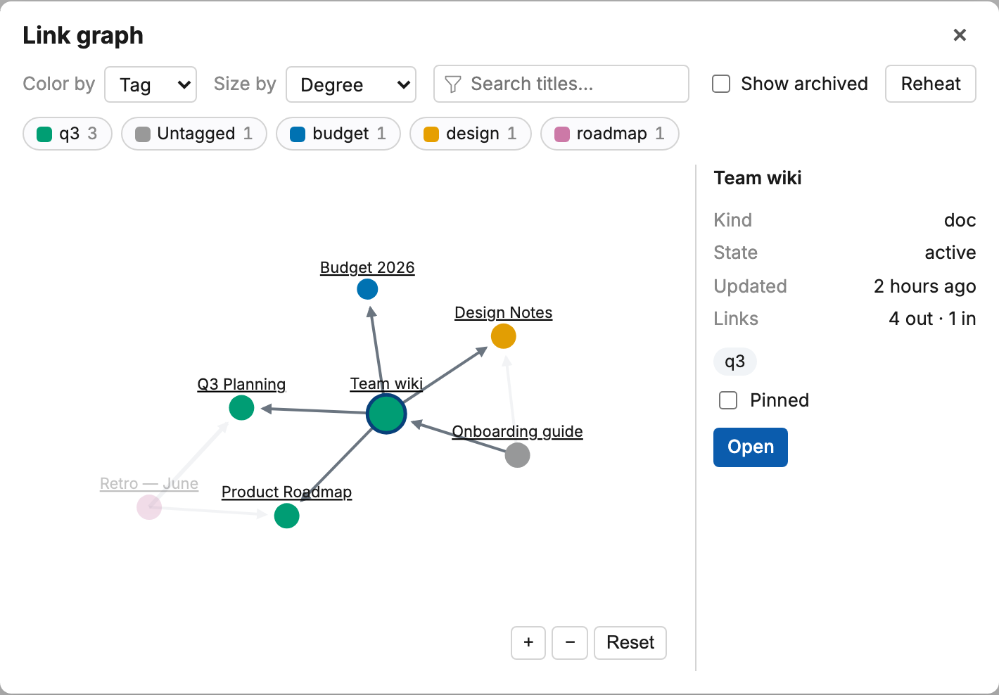
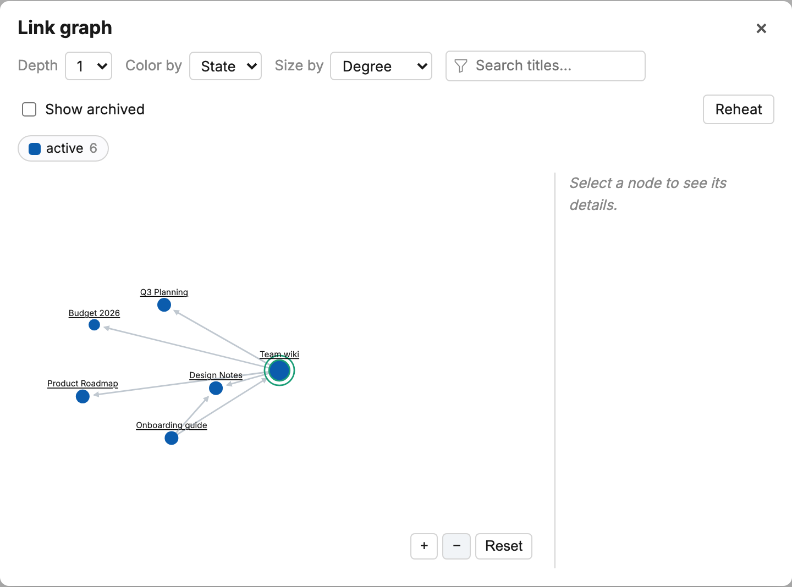
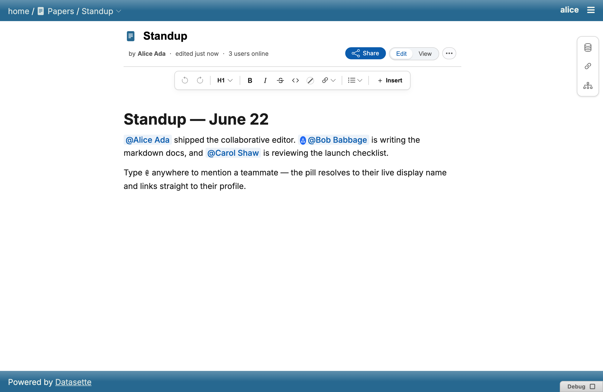
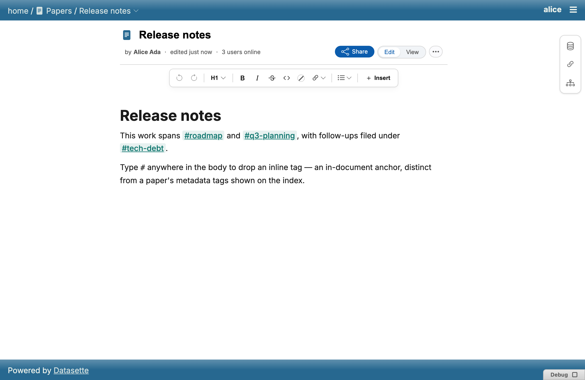
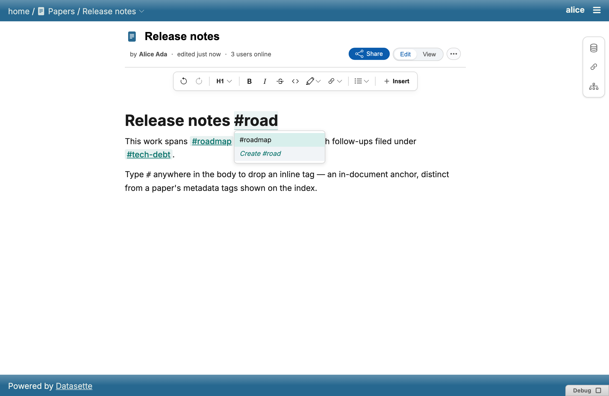
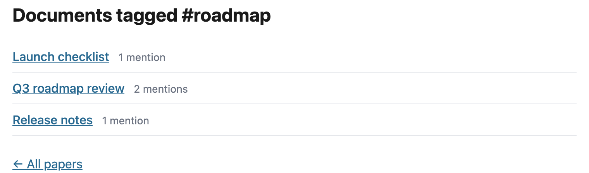
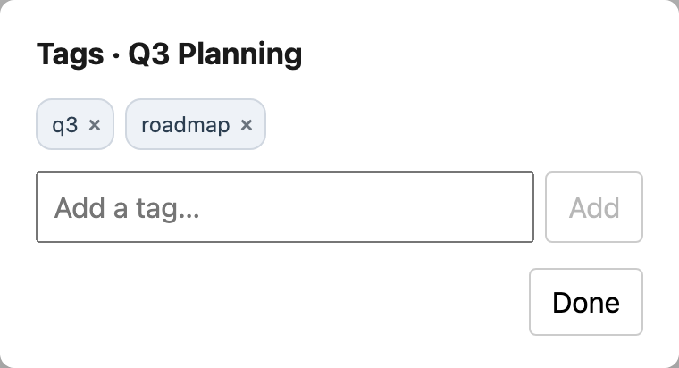

# Links, mentions & tags

Three inline atoms connect a paper to the rest of the workspace.

## Wiki-style links

Type `[[` to open an autocomplete popup listing other papers to link to.
The link is an inline NodeView that resolves the target id to its current
title and round-trips through markdown, so a renamed paper's links update
everywhere automatically.

In edit mode, clicking a link opens it in a new tab; hovering reveals a
tooltip with **Edit**, **Open** and **Copy**. Edit opens a small dialog with
Text and URL fields to rewrite the link.

### Link graph

The link graph turns `[[wiki links]]` into an interactive map of the
workspace — force-directed and zoomable, with nodes colored by tag / state /
kind (the legend doubles as a filter), sized by connections or recency, and
a metadata panel for the selected paper. Every paper also gets a
doc-centred **ego view** from its sidebar: just that paper's neighbourhood,
sliceable to an adjustable link depth.

## Mentions

Type `@` for an autocomplete of actors, then pick one to insert a `@mention`
— an id-only inline atom whose display name is resolved live, per viewer.
Mentioning someone inside a task item also **assigns** that task to them —
see [Editor § Task lists](editor.md#task-lists).

## Inline tags

Drop inline `#tags` anywhere in a paper's body — type `#` for an
autocomplete of existing tags. The tag's value is its own label. Clicking a
tag opens a results page listing every paper whose body mentions it, with a
mention count per paper.

:::{note}
Inline `#tags` (in the body, indexed by `_datasette_paper_inline_tag`) are
distinct from a paper's **document-level metadata tags**, editable from the
tag editor and stored in `_datasette_paper_doc_tag` — see
[Papers as data](papers-as-data.md).
:::

