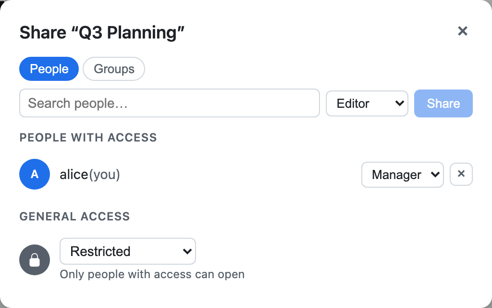

# Sharing

Every paper you create makes you its owner — you get a **Manager** grant on
it automatically, so you can view, edit, and manage its sharing. To let
other people in, open the share dialog from the paper's header.

## Roles

The dialog grants one of three cumulative roles, per person:

- **Viewer** — can view the paper.
- **Editor** — can view and edit it.
- **Manager** — can view, edit, and manage its sharing (grant/revoke access,
  lock, archive, template it). This is what the owner holds automatically.

## General access

Instead of (or alongside) naming individual people, you can grant a role to
**everyone signed in** — the "general access" row in the dialog — which is
the equivalent of the old "anyone with the link" toggle. Access changes take
effect immediately, including for anyone with the paper open right now: a
revoked or downgraded collaborator's live connection is disconnected.

:::{note}
Older versions used per-paper `visibility` levels (`private` / `link-view` /
`link-edit`). Sharing is now owned by
[datasette-acl](https://github.com/datasette/datasette-acl); see
[Permissions](permissions/index.md) for how old `visibility` values map onto
the roles above.
:::
