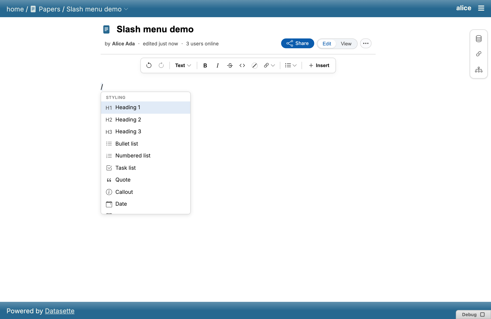
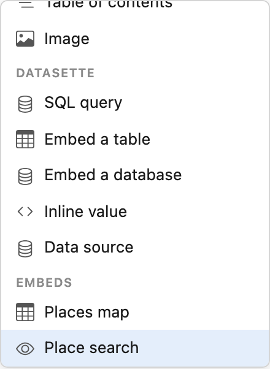
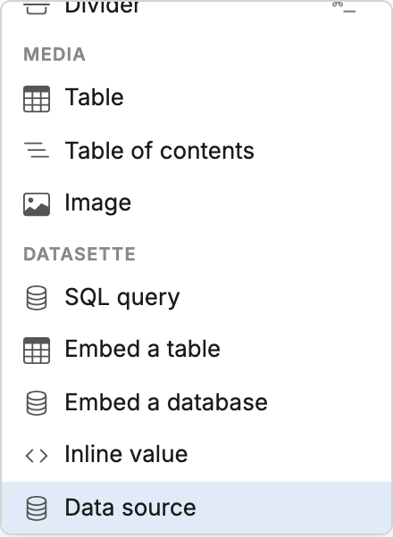

# Slash menu

Type `/` at the start of a block (or after whitespace) to open a Notion-style
command menu for inserting blocks — tables, task lists, callouts, code
blocks, dates, the table of contents, images, and both native Datasette
embeds and third-party [embed providers](custom-embeds.md). Keep typing to
filter by name.

Commands are grouped under non-interactive section headers:

- **Styling** — headings, lists, callouts, dividers, table of contents, code
  blocks, and similar structural blocks.
- **Media** — images and other embedded media.
- **Datasette** — native table/row/database embeds and SQL query blocks
  (see [Sources and values](sources-and-values.md)).
- **Embeds** — third-party [embed providers](custom-embeds.md) registered by
  other installed plugins.

:::{note}
TODO: the full command list per section, and the keyboard-navigation
behaviour (arrow keys / Enter / Escape) once verified against
`frontend/src/lib/slashMenu.ts`'s command registry.
:::
