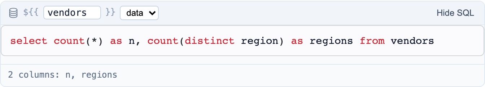
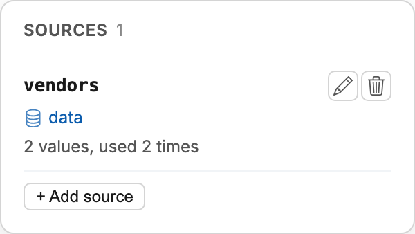
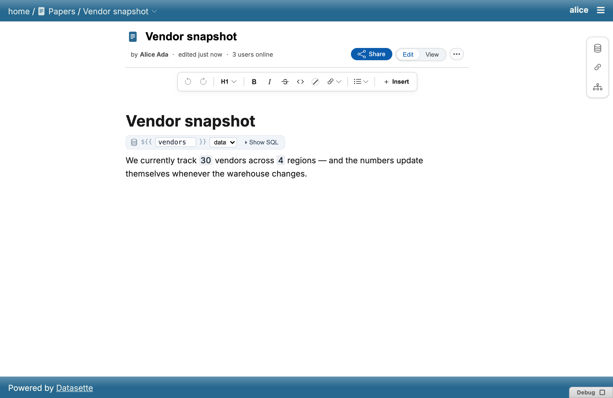
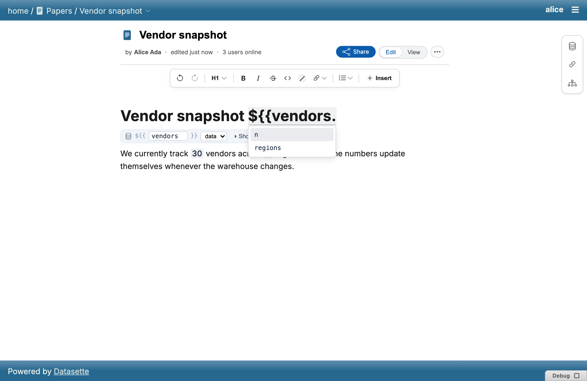
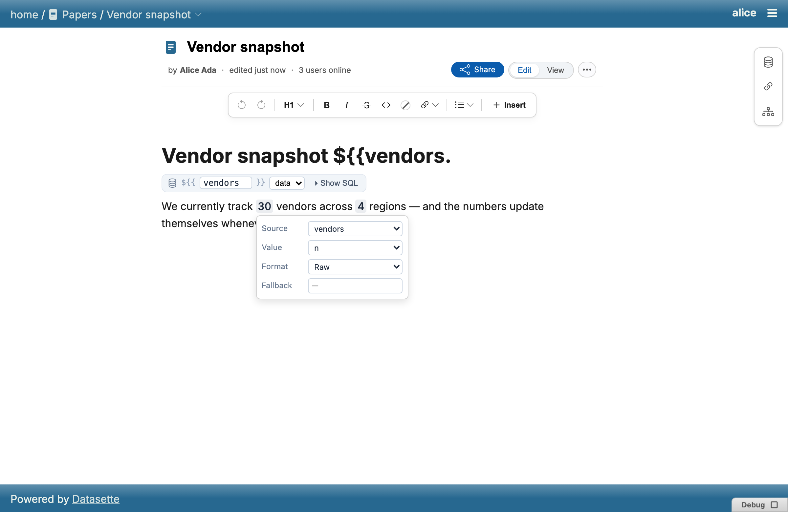
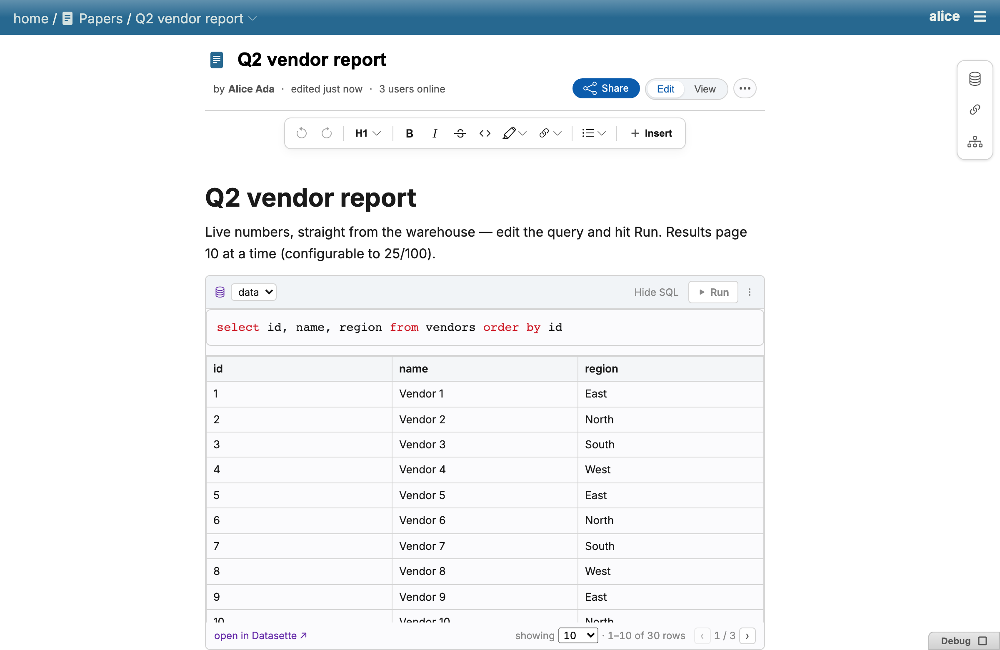
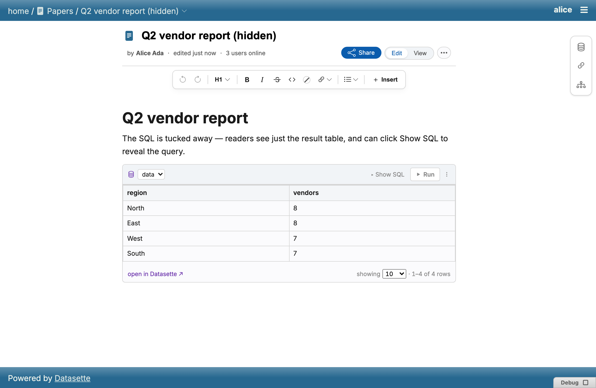

# Sources and values

Two block types and one inline atom let a paper carry live SQL data rather
than a static snapshot.

## Sources

A **source** is a named, parameterless SQL query block — written as a fenced
code block:

````markdown
```source name=NAME db=DB
SELECT ...
```
````

Its SQL surface upgrades to a full CodeMirror editor on focus (a collapsed
source pill declines the mount). Inline [value](#values) atoms reference a
source by name.



The right-hand sidebar surfaces a paper's source blocks (alongside its
Links panel) so named queries are discoverable without scrolling the
document, and lets you draft new source SQL in a standalone editor field.



## Values

An inline atom rendering a single live value from a named source, written
as `${{source.column}}` — the leading `$` keeps it visually and
syntactically disjoint from a template
[placeholder](getting-started.md#templates)'s bare `{{key}}`. Each viewer
fetches the value themselves, so it always reflects their own access.



Click a value to edit which source and column it references:





## SQL blocks

An editable SQL query block — written as a fenced ` ```sql db=NAME ` block —
run per-viewer against a named Datasette database, independent of any
source. Its surface upgrades to a CodeMirror editor on focus, with SQLite
keyword completion and `Mod-Enter` to run; results are cached per
`(db, sql)` pair across the static ↔ CodeMirror rebuild.





Both `source` and `sql_block` share the same code-editor chrome and static
syntax highlighting described in [Editor § Code blocks](editor.md#code-blocks).
